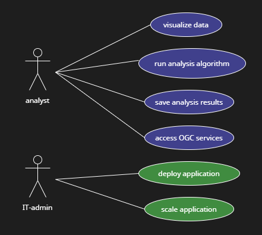
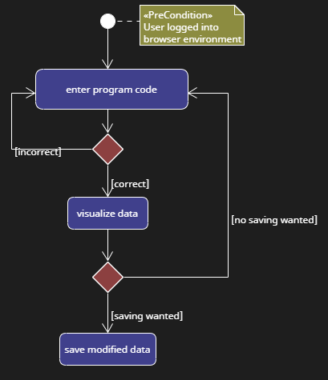
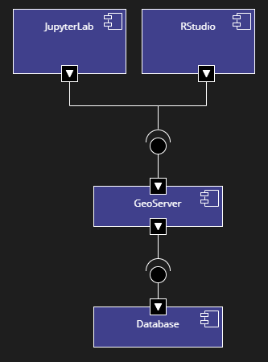

# Verteilte Geoanalyseplatform für Umweltdaten

## Anforderungen

Forschende und Expert:innen sollen Umweltdaten im Browser interaktiv mit R und Python analysieren und visualisieren können. Dazu soll es JupyterLab- und RStudioServer-Umgebungen geben, die bereits vorhandene Umweltdaten enthalten.
Die Anwendung soll mit Docker Compose entwickelt werden und kann öffentlich verfügbare Docker Images benutzen.
Die Skalierbarkeit und Mehrbenutzer-Nutzung soll diskutiert werden.

*Use-Case-Diagramm*

Im Use-Case-Diagramm werden die typischen Anwendungsfälle dargestellt. Die Forschenden und Expert:innen (Analysts) möchten in RStudio und Jupyter die Daten visualisieren, ihre Skripte ausführen und Ergebnisse speichern. Außerdem möchten sie auch außerhalb der RStudio- und Jupyter-Umgebungen auf die OGC Webservices zugreifen.

*Aktivitätsdiagramm aus Nutzer:innensicht. Es stellt den typischen Ablauf eines Programms dar, das in RStudio oder JupyterNotebook ausgeführt werden kann.*

Das Aktivitätsdiagramm zeigt einen typischen Ablauf eines der Python- oder R-Programme.

## Umsetzung

*Komponentendiagramm. Die Komponenten entsprechen den Docker-Containern.*

Das Komponentendiagramm zeigt die Docker-Container und die Schnittstellen.
Der Geoserver holt die Daten (z.B. GeoPackage) von der Datenbank.
Der Geoserver stellt einen WMS zur Verfügung, über das mit HTTP aus JupyterLab und RStudio zugegriffen werden kann.

## Diskussion
### Deployment
Durch die Nutzung von Docker-Containern lässt sich die verteilte Anwendung relativ leicht auf anderen Rechnern deployen. 
Der Zugriff auf die Datenbank im Geoserver muss noch einmalig manuell konfiguriert werden. Dazu müssen ein Datastore und die gewünschten Layer angelegt werden. Beim Neustarten eines Containers sind diese Schritte jedoch durch die Nutzung von Volumes nicht mehr nötig.

Das einmalige Konfigurieren des GeoServers könnte durch ein Skript vermieden werden, das sich bei Erstellung des GeoServer-Containers mit der GeoServer-API verbindet. Das war leider zeitlich im Rahmen der Projektarbeit nicht mehr möglich.
Ansätze dafür sind im Ordner `geoserver-api-scripts` zu finden.

### Sicherheit
Passwörter für den Zugriff auf JupyterNotebook, GeoServer, PostgreSQL und RStudio werden für die Erstellung der Container als Umgebungsvariable übergeben. Um die Passwörter nicht öffentlich sichtbar in die `compose.yaml` schreiben zu müssen, können sogenannte __Secrets__ verwendet werden. 
Statt die Passwörter direkt zu übergeben, kann durch die Secrets ein Dateipfad zum Passwort angegeben werden. Dazu müssen allerdings die richtigen Umgebungsvariablen herausgefunden werden. Bei PostgreSQL ist das z.B. `POSTGRES_PASSWORD_FILE` statt `POSTGRES_PASSWORD`.

### Skalierbarkeit
In einer Produktivumgebung kann es sein, dass Container ausfallen.
In diesem Fall muss ein neuer Container gestartet werden. 
Dabei hilft __Kubernetes__. In einer Konfigurationsdatei kann ein Soll-Zustand für die Infrastruktur festgelegt werden. Zum Beispiel die Anzahl der Instanzen eines Containers, die Konfiguration eines Load Balancers und die verfügbare Hardware pro Container. Kubernetes kümmert sich um die Erhaltung dieses Zustands.

Manchmal ist es notwendig, einer Anwendung eine höhere Rechenleistung oder mehr Speicher zur Verfügung zu stellen, zum Beispiel weil die Nutzer:innenzahl steigt. Um flexibel und schnell zu skalieren, kann __Cloud Computing__, z.B. mit Amazon Web Services verwendet werden. Das bedeutet, die Anwendung zieht gegen Gebüren auf fremde Server um. So muss sich um die Punkte Anschaffung, Wartung und Ausfallsicherheit nicht mehr gesorgt werden.

Die Kubernetes-Konfiguration kann dann einfach an die neuen Kapazitäten der Hardware angepasst werden.